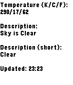

# owm-weather

Library for easy fetching of weather data from [OpenWeatherMap.org](http://home.openweathermap.org).

Includes a simple test app as a proof of concept usage of a weather C API.




## How to use

* Obtain an API key from [OpenWeatherMap.org](http://home.openweathermap.org/users/sign_up).

* Add these `AppMessage` keys to the `appKeys` array in `appinfo.json`:

```
"OWMWeatherAppMessageKeyRequest": 0,
"OWMWeatherAppMessageKeyReply": 1,
"OWMWeatherAppMessageKeyDescription": 2,
"OWMWeatherAppMessageKeyDescriptionShort": 3,
"OWMWeatherAppMessageKeyName": 4,
"OWMWeatherAppMessageKeyTempK": 5,
"OWMWeatherAppMessageKeyPressure": 6,
"OWMWeatherAppMessageKeyBadKey": 91,
"OWMWeatherAppMessageKeyLocationUnavailable": 92
```

* Insert `owm_weather/owm_weather.js` into the top of your apps' `pebble-js-app.js`.

* Call `owmWeatherHandler()` in an `appmessage` handler so that it can message the C side.

```
Pebble.addEventListener('appmessage', function(e) {
  owmWeatherHandler(e);
});
```

* Copy the `owm_weather` directory into your project's `src` directory and include the library in any C files that will use it:

```
#include "owm_weather/owm_weather.h"
```

* Call `owm_weather_init()` to initialize the library when your app starts, supplying your API key.

* Call `owm_weather_fetch()`, after PebbleKit JS is ready supplying a suitable
  callback for events.

That's it! When the fetch returns (successful or not), the callback will be called with a `OWMWeatherInfo` object for you to extract data from.


## Documentation

Read `owm_weather/owm_weather.h` for function and `enum` documentation.


## Data returned

**Available now**

* Description, short description, temperature in K/C/F, location name.

**Not implemented, but possible**

Anything else detailed in the JSON response.
